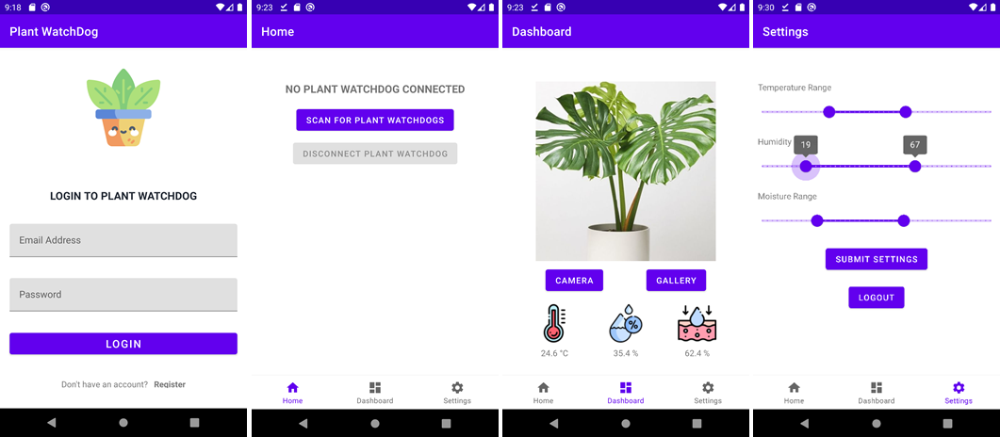

# MSE TSM MobCom Project - Plant WatchDog

## Description
The Plant WatchDog is a health monitor for indoor plants. The product consists of an android app and a connected device. The app and the device exchange data using Bluetooth low energy. The product makes it possible to keep track of three different values, which are quite important for the plant's health. Temperature, humidity, and the moisture of the substrate the plant is rooted in. Plant WatchDog makes it possible for its users to keep track of these parameters and apply countermeasures if some values are outside of the plants happy range.

With the help of Plant WatchDog, your indoor plant will live a happy life!

## Team
* [Mark Straub](https://github.com/MarkStraub)
* [Jonathan Bättig](https://github.com/jbaettig)

## Docs
* [Slides](Docs/Slides.pdf)
* [Video](Docs/Video.mp4)

## Code
* [Android](Android)
* [Arduino](Arduino)

## APK
* [Plant WatchDog](Android/PlantWatchDog/app/release)